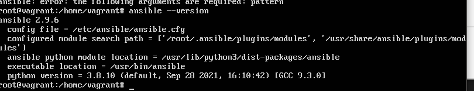

Домашнее задание к занятию "5.2. Применение принципов IaaC в работе с виртуальными машинами"

**Задача 1**
_Опишите своими словами основные преимущества применения на практике IaaC паттернов.
Какой из принципов IaaC является основополагающим?_

При должном применении преимуществами будут:
- сокращение времени на подготовку среды и доставку/развертывание приложений
- возможность версионирования и как следствие параллельной разработки в части инфраструктуры и быстрого отката к предыдущим значениям
- единый источник правды и быстрое считывание конфигурации, что упрощает передачу знаний между инженерами
- снижение вероятности дрифта конфигурации 
- снижение риска человеческой ошибки при применении изменений

Основопологающий принцип я помнимаю как культуру инженеров не лезть делать ручных изменений в инфраструктуре без (бизнес-)критичной необходимости.

**Задача 2**
_Чем Ansible выгодно отличается от других систем управление конфигурациями?
Какой, на ваш взгляд, метод работы систем конфигурации более надёжный push или pull?_

Ансибл позволяет выполнять плейбуки на машинах с минимальными зависимостями ( нужны только ssh и python, которые много где по дефолту уже есть в дистрибутиве ос).
Смотря что называть надежным. Если мы подразумеваем, что мы всегда знаем, что машины настроены именно так как в коде, то только pull.
Если же мы говорим о том, что мы всегда можем внести изменения в конфигурацию машины из кода, то push, так как мало ли что с клиентом может приключиться на сервере.

**Задача 3**
_Установить на личный компьютер:_

VirtualBox
Vagrant
Ansible
Приложить вывод команд установленных версий каждой из программ, оформленный в markdown.

    PS C:\Program Files\Oracle\VirtualBox> .\VBoxManage.exe --version
    6.1.26r145957

    PS C:\Program Files\Oracle\VirtualBox> vagrant --version
    Vagrant 2.2.18

Работаю на винде, поэтому ансибл на виртуалке.

Задача 4 (*)
Воспроизвести практическую часть лекции самостоятельно.

Создать виртуальную машину.
Зайти внутрь ВМ, убедиться, что Docker установлен с помощью команды docker ps

Не очень хочу настраивать вложенную виртуализацию, чтобы ставить на виртуалке с убунтой внутрь еще виртуалку и внутри нее докер.
Но отдельно машина создалать из конфига и отдельно плейбук отработал на localhost (ключ не прокидывал, потому что не нужно)

